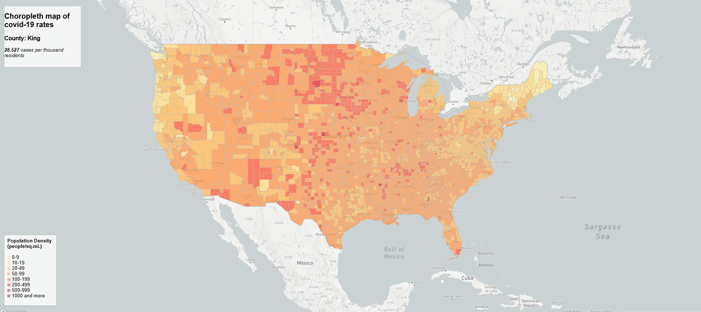
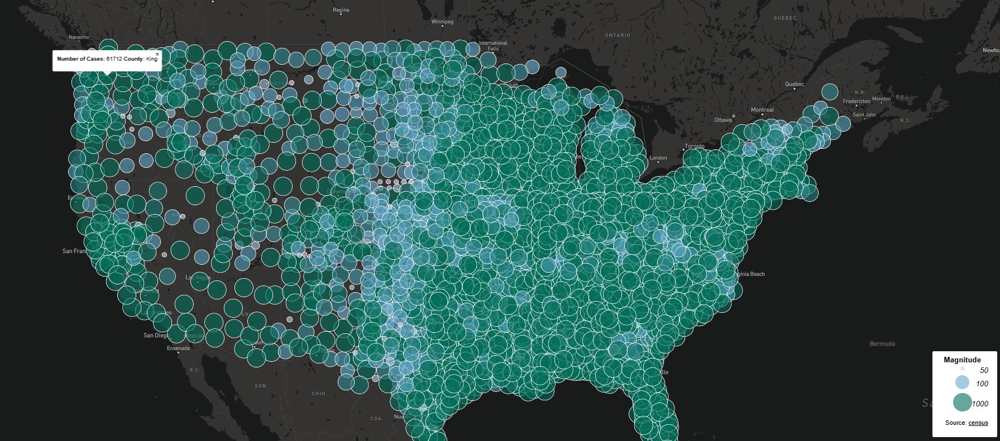

# cloropeth-covid-rates-countskel
## Introduction
### For the project I have 2 maps, the first one being the chlorpeth map of covid 19 rates in the U.S and the

## Map links
[Map 1](https://knel2.github.io/cloropeth-covid-rates-countskel/map1.html)
[Map 2](https://knel2.github.io/cloropeth-covid-rates-countskel/map2.html)

## Screenshots

## Primary Functions

## Library in use, data sources used and ackowledgements

